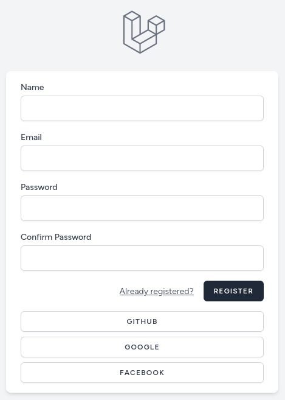
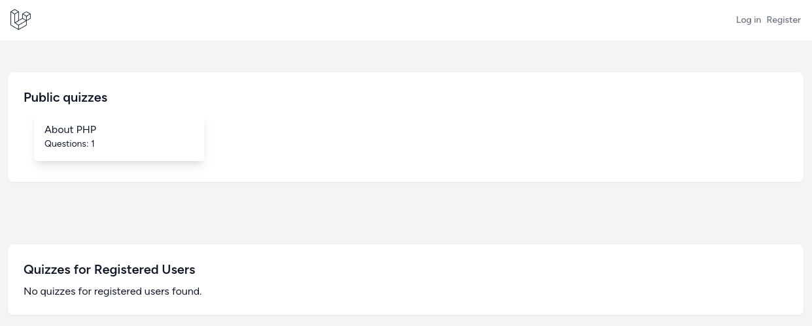
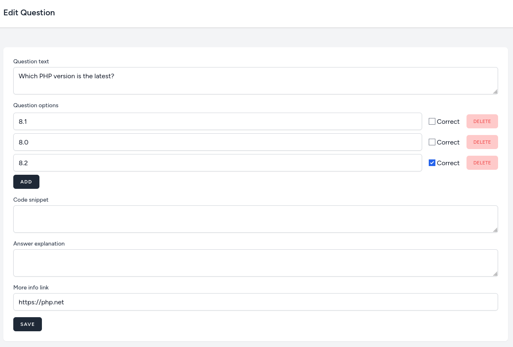
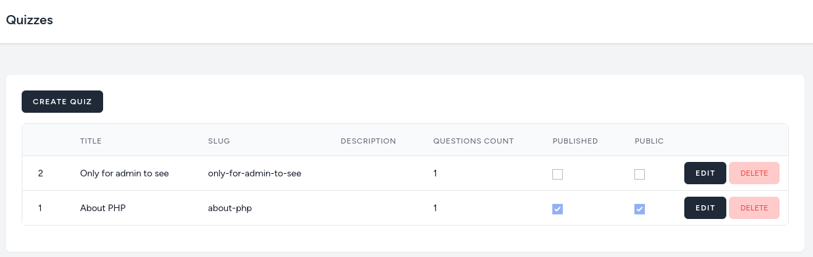
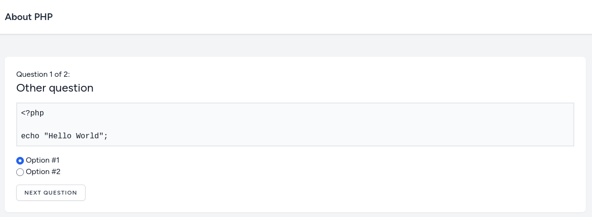
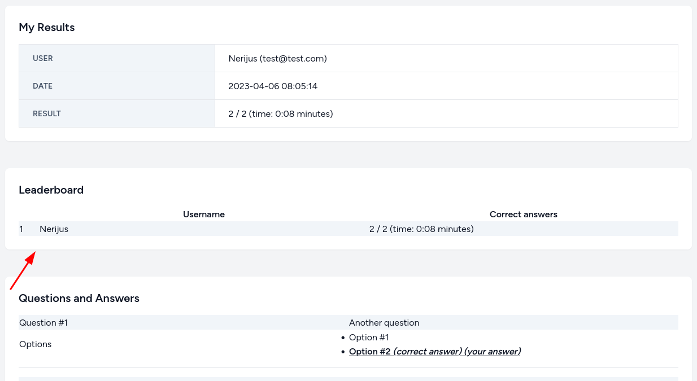
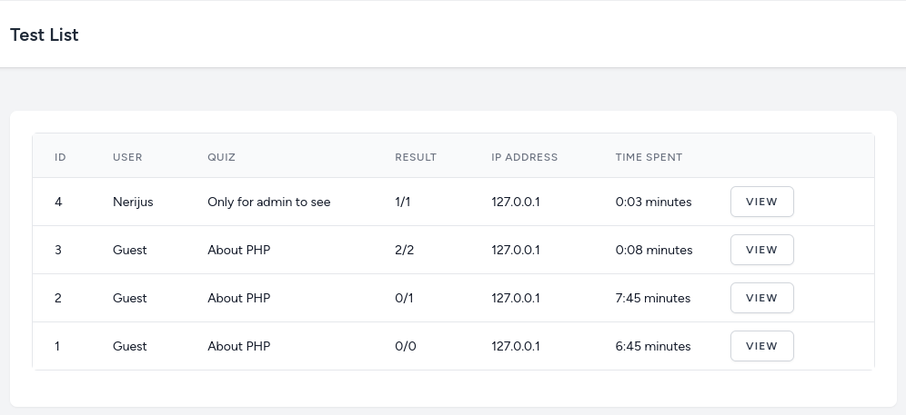

## Quiz System With TALL (TAilwind, Alpinejs, Livewire, Laravel)
This is a simple quiz/testing system with Laravel, adding a lot of Livewire components for dynamic behavior


### Key Features
<li>TALL (Tailwind, Alpinejs, Laravel, Livewire)</li>
<li>Managing Quiz</li>
<li>Managing Question</li>
<li>Managing Question Option</li>
<li>Managing Quiz Test</li>
<li>Managing Quiz Test Results</li>
<li>Timer for Quizzes</li>
<li>Leaderboard</li>
<li>Social Login (Google, Facebook, Github)</li>
<li>Profile Management</li>
<li>Profile Setting Management</li>
<li>Beautiful User Interface</li>
<li>2 Types of Users Management (Admin, User)</li>
<li>Organized & Maintainable Code</li>
<li> and many more. </li>

## Setup
```bash
# Clone the repo
git clone https://github.com/devboyarif/quiz-system.git

# Install composer dependency
composer install

# Install node modules 
npm install / yarn

# Copy environment file
cp .env.example .env

# Set the Application key
php artisan key:generate

# setup the database credentials and migrate database with seeders
php artisan migrate --seed

```

## Development Server

Start the development server on http://localhost:8000

```bash
php artisan serve
```
```bash
npm run watch / yarn watch
```


## Demo Screenshots
 <br>
<br>
<br>
<br>
<br>
<br>
<br>

